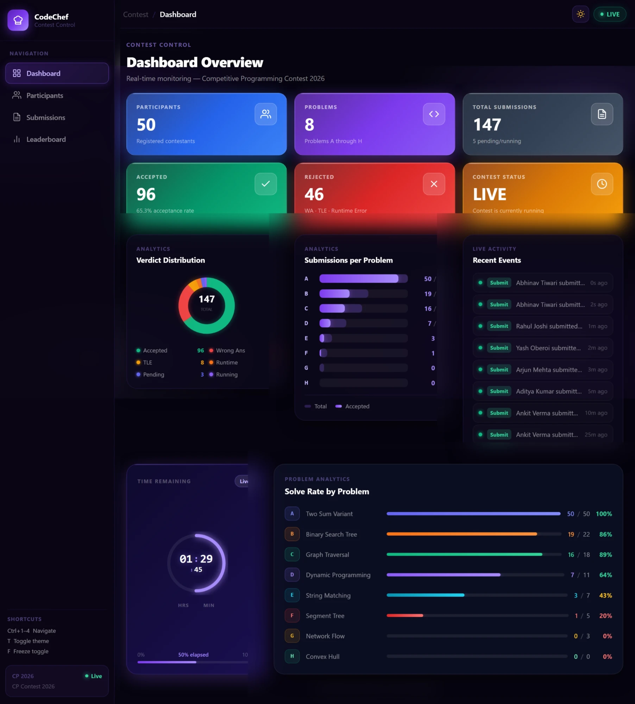
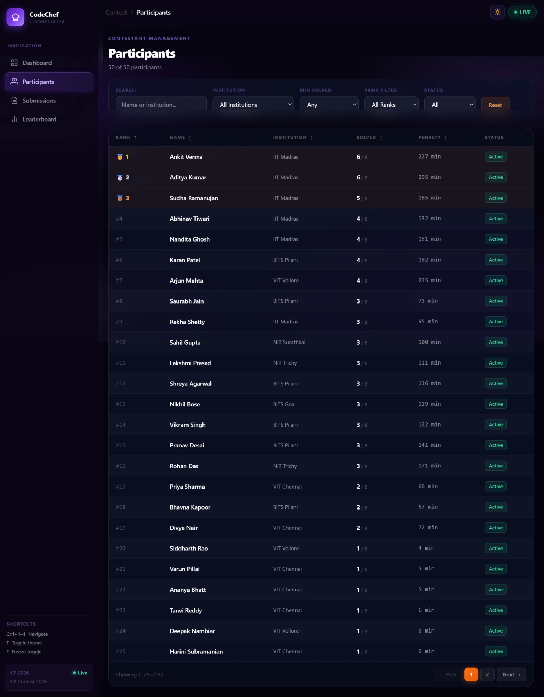
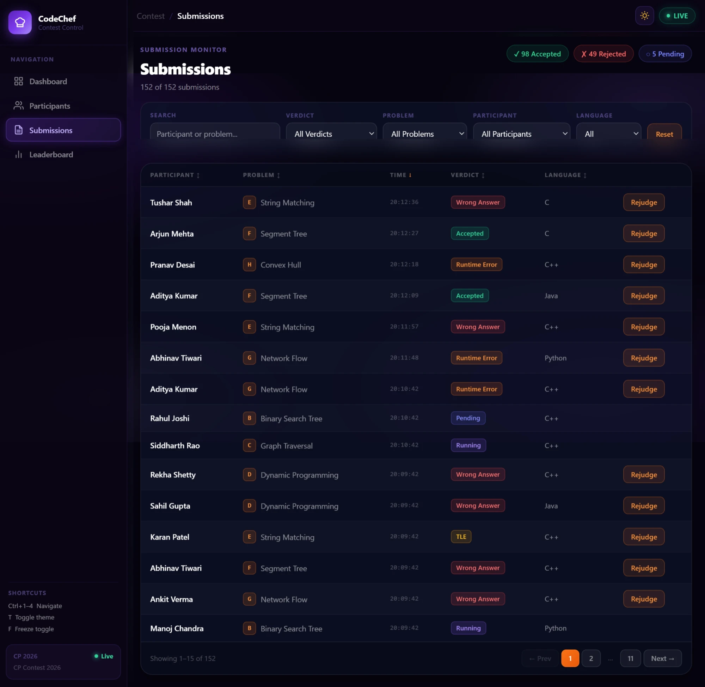
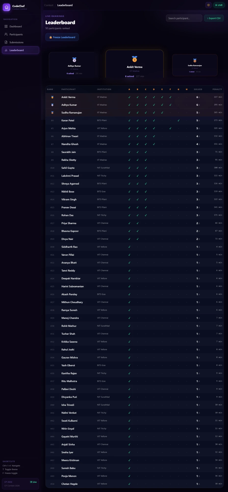

# CodeChef Contest Control Center

A responsive, real-time frontend dashboard for managing and monitoring competitive programming contests — built as a recruitment assignment for CodeChef VIT.

**Live Demo:** [https://contest-control-center-weld.vercel.app](https://contest-control-center-weld.vercel.app)

---

## Project Setup Instructions

### Prerequisites
- Node.js v18 or higher
- npm v9 or higher

### Steps

```bash
# 1. Clone the repository
git clone https://github.com/Android-dotcom69/contest.git
cd contest

# 2. Install dependencies
npm install

# 3. Start development server
npm run dev
```

Open [http://localhost:5173](http://localhost:5173) in your browser.

```bash
# Build for production
npm run build

# Preview production build locally
npm run preview
```

> No environment variables are required. The app runs entirely on local mock data.

---

## Tech Stack

| Layer | Technology |
|---|---|
| Framework | React 19 |
| Bundler | Vite 8 |
| Routing | React Router DOM v7 |
| State Management | Zustand v5 |
| Styling | CSS custom properties (inline styles) + Tailwind CSS v4 |
| Deployment | Vercel |
| Linting | oxlint |

---

## Folder Structure

```
contest/
├── public/
├── src/
│   ├── components/
│   │   ├── dashboard/          # Dashboard widgets
│   │   │   ├── ActivityFeedPreview.jsx
│   │   │   ├── ContestTimer.jsx
│   │   │   ├── ProgressOverview.jsx
│   │   │   ├── StatsCard.jsx
│   │   │   ├── SubmissionsBarChart.jsx
│   │   │   └── VerdictDonut.jsx
│   │   ├── layout/
│   │   │   └── Layout.jsx      # Sidebar + topbar shell, keyboard shortcuts
│   │   ├── leaderboard/
│   │   │   ├── FreezeToggle.jsx
│   │   │   └── LeaderboardTable.jsx
│   │   ├── participants/
│   │   │   ├── ParticipantFilters.jsx
│   │   │   └── ParticipantTable.jsx
│   │   ├── submissions/
│   │   │   ├── RejudgeModal.jsx
│   │   │   ├── SubmissionFilters.jsx
│   │   │   └── SubmissionTable.jsx
│   │   └── ui/
│   │       └── Badge.jsx       # Reusable verdict/status badge
│   ├── data/                   # Static mock datasets
│   │   ├── activities.js
│   │   ├── contest.js
│   │   ├── participants.js
│   │   ├── problems.js
│   │   └── submissions.js
│   ├── hooks/                  # Custom React hooks
│   │   ├── useContestStats.js  # Derived stat counts
│   │   ├── useIsMobile.js      # Responsive breakpoint detection
│   │   ├── useLeaderboard.js   # Live vs frozen leaderboard selector
│   │   └── useSimulator.js     # Starts the live submission simulator
│   ├── lib/
│   │   ├── formatters.js       # Penalty time formatter
│   │   ├── ranking.js          # Leaderboard ranking algorithm
│   │   └── simulator.js        # Real-time submission generator
│   ├── pages/
│   │   ├── Dashboard.jsx
│   │   ├── Leaderboard.jsx
│   │   ├── Participants.jsx
│   │   └── Submissions.jsx
│   ├── store/                  # Zustand stores
│   │   ├── activityStore.js
│   │   ├── contestStore.js
│   │   ├── participantStore.js
│   │   ├── submissionStore.js
│   │   └── themeStore.js
│   ├── App.jsx
│   ├── index.css               # CSS variables for dark/light theming
│   └── main.jsx
├── vercel.json                 # SPA rewrite rule for React Router
└── package.json
```

---

## State Management Approach

Zustand is used for all global state, split into five focused stores:

| Store | Responsibility |
|---|---|
| `submissionStore` | Holds all submissions; exposes `addSubmission`, `resolveSubmission`, `rejudge`, `undoRejudge` |
| `contestStore` | Contest metadata + freeze mode; `toggleFreeze` snapshots the leaderboard and logs to activity |
| `participantStore` | Participant list (static, readable by leaderboard and participant page) |
| `activityStore` | Append-only activity log; newest entry prepended to the array |
| `themeStore` | Dark/light mode toggle; persists to `localStorage` and applies `data-theme` on `<html>` |

**Derived state** (leaderboard rankings, stat counts, filtered/sorted rows) is computed with `useMemo` inside custom hooks (`useLeaderboard`, `useContestStats`) and page components — keeping stores as pure data sources with no computed logic inside them.

---

## Data Flow

```
Mock Data (src/data/)
        │
        ▼
  Zustand Stores  ◄──── Simulator (generates live submissions every 6–14s)
        │                      │
        │               resolveSubmission() called 2–4s later
        │
        ▼
  Custom Hooks
  ┌─────────────────────────────────────┐
  │ useLeaderboard  →  useMemo over     │
  │                    submissions +    │
  │                    freeze snapshot  │
  │ useContestStats →  useMemo counts   │
  └─────────────────────────────────────┘
        │
        ▼
   Page Components  →  Filter/Sort (useMemo)  →  UI Tables/Charts
```

**Live Update Cycle:**
1. `simulator.js` picks a random participant + an unsolved problem every 6–14 seconds
2. `addSubmission()` fires with verdict `running` → appears instantly in Submissions table and Activity Feed
3. After 2–4 seconds, `resolveSubmission()` updates the verdict → leaderboard recalculates, charts re-render, activity feed logs the final result

**Rejudge Cycle:**
1. Admin opens Rejudge modal from Submissions page and selects a new verdict
2. `rejudge(id, newVerdict)` updates the submission and pushes to `undoStack`
3. All derived state (leaderboard, stat cards, donut chart) recomputes automatically via Zustand reactivity

---

## Assumptions Made

1. **No backend required** — the application uses entirely local mock data as specified in the assignment.
2. **Contest is always Live** — the mock contest starts 90 minutes before page load and ends 90 minutes after, placing it in an always-live state for demonstration purposes.
3. **50 participants, 8 problems** — a realistic contest scale that keeps the UI performant while showing meaningful leaderboard variation.
4. **Sequential problem difficulty** — Problems are labeled A–H in increasing difficulty, reflected in the submission data (more participants solve A than H).
5. **Simulator is client-side only** — the live submission feed is generated by a JavaScript interval timer. In a real deployment this would be replaced by a WebSocket or server-sent events connection.
6. **Penalty time calculation** — computed as `(submission time - contest start) + 20 minutes per wrong attempt`, matching ICPC-style scoring used in CodeChef contests.
7. **Freeze mode** — when activated, the leaderboard display freezes to the snapshot at that moment, but new submissions continue to arrive and appear in the Submissions page, as required by the spec.
8. **Theme preference** — stored in `localStorage` under the key `cc-theme` and restored on every page load.

---

## Screenshots

### Dashboard


### Participants


### Submissions


### Leaderboard


---

## Bonus Features Implemented

- **Dark / Light Mode** — full theme toggle with CSS variable system, persisted to localStorage
- **Drag-and-Drop Widgets** — dashboard charts reorderable via HTML5 drag-and-drop API
- **Export Leaderboard as CSV** — downloads current rankings as a `.csv` file
- **Keyboard Shortcuts** — `Ctrl+1–4` navigate pages · `T` toggles theme · `F` toggles freeze
- **Undo Last Rejudge** — reverts the most recent rejudge action (stack of up to 9)
- **Real-time Simulation** — live submissions arrive every 6–14 seconds, resolve after 2–4 seconds

---

## Deployment

Deployed on **Vercel** with a SPA rewrite rule (`vercel.json`) to handle client-side routing:

```json
{ "rewrites": [{ "source": "/(.*)", "destination": "/index.html" }] }
```

**Live URL:** [https://contest-control-center-weld.vercel.app](https://contest-control-center-weld.vercel.app)
